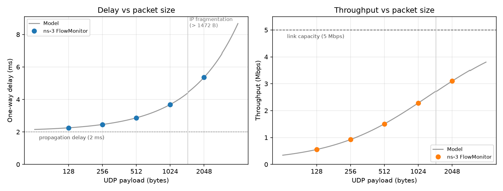

# Computer Networks Lab

Hands-on work from an undergraduate Computer Networks course, in three parts:

| Part | Tool | What it covers |
|---|---|---|
| [`ns3-udp-echo/`](ns3-udp-echo/) | ns-3 (Python bindings) | Point-to-point UDP echo simulation with FlowMonitor. Delay and throughput measured across packet sizes and checked against an analytical model |
| [`wireshark-http-analysis/`](wireshark-http-analysis/) | Wireshark | One live HTTP request/response pair, dissected layer by layer (Ethernet → IPv4 → TCP → HTTP) |
| [`packet-tracer-app-protocols/`](packet-tracer-app-protocols/) | Cisco Packet Tracer | Simulated HTTP, SMTP and POP3 exchanges, including the DNS and ARP steps before them |

---

## ns-3: UDP echo over a point-to-point link

```
 n0  10.1.1.1  ─────────  5 Mbps, 2 ms  ─────────  n1  10.1.1.2
 UdpEchoClient                                      UdpEchoServer (port 9)
```

The client sends one UDP echo request at t = 2 s and the server echoes it back. FlowMonitor records per-flow bytes, packets, loss, delay and throughput. The simulation was run for payloads of 128, 256, 512, 1024 and 2048 bytes.



| UDP payload (B) | IP packet (B) | Frames on the wire | One-way delay (ms) | Throughput (Mbps) | Loss |
|---:|---:|---:|---:|---:|---:|
| 128  | 156  | 1 | 2.2528 | 0.554 | 0 |
| 256  | 284  | 1 | 2.4576 | 0.924 | 0 |
| 512  | 540  | 1 | 2.8672 | 1.507 | 0 |
| 1024 | 1052 | 1 | 3.6864 | 2.283 | 0 |
| 2048 | 2076 | 2 | 5.3600 | 3.099 | 0 |

Raw data: [`results/packet_size_sweep.csv`](ns3-udp-echo/results/packet_size_sweep.csv) (both directions of every run).

### What the numbers show

**The delay is fully explained by two terms.** One-way delay = propagation + serialization:

$$d = 2\ \text{ms} + \frac{8 \times (\text{IP bytes} + 2\ \text{B PPP header per frame})}{5\ \text{Mbps}}$$

For 1024 B: (1052 + 2) × 8 / 5 Mbps = 1.6864 ms, plus 2 ms gives **3.6864 ms**. That is exactly what FlowMonitor reported. The model matches every measured point to the nanosecond, because the link is idle and there is no queueing.

**2048 B gets fragmented.** The point-to-point MTU is 1500 B, so any payload above 1472 B (1500 − 20 IP − 8 UDP) is split at the IP layer. The 2048 B payload goes out as two fragments, 1500 B and 596 B. The second fragment adds another IP header and PPP header, so 2100 B are serialized, not 2078 B. The model accounts for this and still matches: 2100 × 8 / 5 Mbps + 2 ms = **5.36 ms**.

**Throughput rises with packet size but never reaches link capacity.** A single packet pays the fixed 2 ms propagation delay regardless of its size. Bigger packets spread that cost over more bits, so throughput climbs from 0.55 Mbps toward the 5 Mbps line rate. It can't reach it, because the 2 ms is never hidden.

> **A correction to the original lab.** The original script computed throughput as `rxBytes * 8 / 18`, dividing by the fixed 18 s window between client start and simulation stop. With one packet per run, that is just packet size times a constant. So the "strong linear relationship" in the original report was built into the formula, not measured. The rewritten script divides by the flow's active time (first packet sent → last packet received) instead, which produces the curve above.

### Running it

Requires [ns-3.40](https://www.nsnam.org/releases/ns-3-40/) built with Python bindings (the lab setup used `cppyy==2.4.1`):

```bash
cd ns-allinone-3.40/ns-3.40
./ns3 configure --enable-python-bindings
./ns3 build
./ns3 shell                       # sets up PYTHONPATH for `from ns import ns`
```

Then, inside that shell:

```bash
python3 /path/to/ns3-udp-echo/udp_echo_flowmon.py --packet-size 1024   # single run
python3 /path/to/ns3-udp-echo/sweep.py                                 # all sizes -> results/packet_size_sweep.csv
```

Plotting needs only matplotlib, not ns-3:

```bash
python3 ns3-udp-echo/plot_results.py
```

| Script | Purpose |
|---|---|
| [`udp_echo_flowmon.py`](ns3-udp-echo/udp_echo_flowmon.py) | The simulation. Options: `--packet-size`, `--packets`, `--interval`, `--data-rate`, `--delay`, `--csv` |
| [`sweep.py`](ns3-udp-echo/sweep.py) | Runs the simulation once per packet size and collects every flow into one CSV |
| [`plot_results.py`](ns3-udp-echo/plot_results.py) | Plots measured delay and throughput against the analytical link model |

The topology and application setup follow ns-3's tutorial script `examples/tutorial/first.py`. FlowMonitor, the parameters, the sweep and the analysis were added on top.

---

## Wireshark: anatomy of an HTTP exchange

A browser was captured fetching an intermediate TLS certificate over plain HTTP (`GET /` to `r3.i.lencr.org`, answered with `200 OK`, `application/pkix-cert`). Both packets are walked through every layer, and request and response are compared side by side: mirrored MAC addresses, IPs and ports, TTL differences, TCP sequence/acknowledgement numbers, and a response reassembled from several TCP segments.

→ [Full write-up with screenshots](wireshark-http-analysis/)

## Packet Tracer: HTTP, SMTP and POP3

A small simulated network with a web server and an email server. The PDUs are traced for a web page load, sending an email (SMTP) and retrieving it (POP3). It also shows the DNS and ARP lookups each exchange depends on.

→ [Write-up](packet-tracer-app-protocols/)
