# Wireshark: Anatomy of an HTTP Exchange

Traffic from a Windows laptop was captured with the display filter `http`. One request/response pair was picked and dissected at every layer.

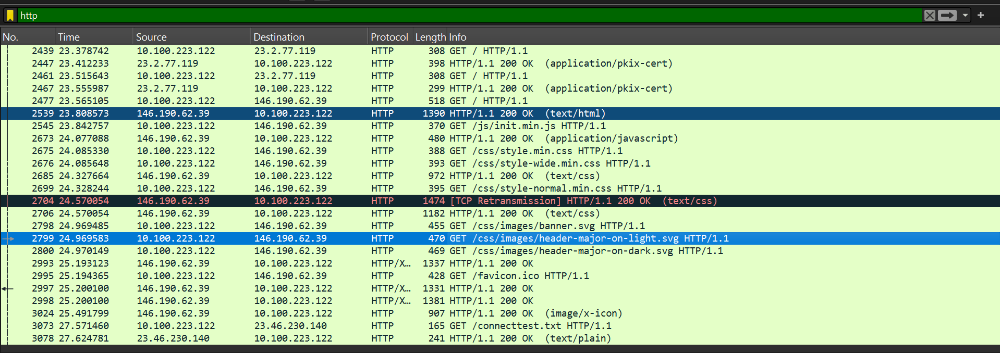

| | Request | Response |
|---|---|---|
| Frame | 2461 | 2467 (40.3 ms later) |
| Summary | `GET / HTTP/1.1` | `HTTP/1.1 200 OK (application/pkix-cert)` |
| Client | 10.100.223.122 : 59063 | |
| Server | 23.2.77.119 : 80 (`r3.i.lencr.org`) | |

The browser is downloading Let's Encrypt's **R3 intermediate certificate** (`R3.der`) to complete a TLS certificate chain. This kind of fetch uses plain HTTP on port 80. A certificate is already signed by its issuer, so encrypting the transfer adds nothing. That also explains why a browser that "only uses HTTPS" still shows up under an `http` filter.

---

## Layer by layer

### 1. Frame (capture metadata)

| Request | Response |
|---|---|
| 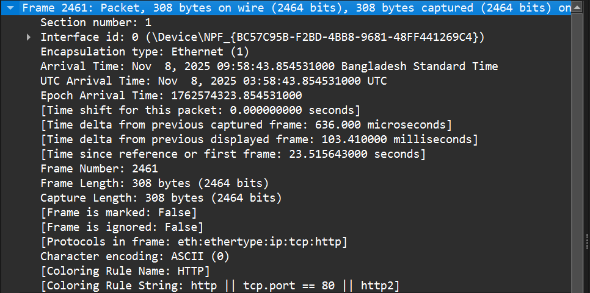 | 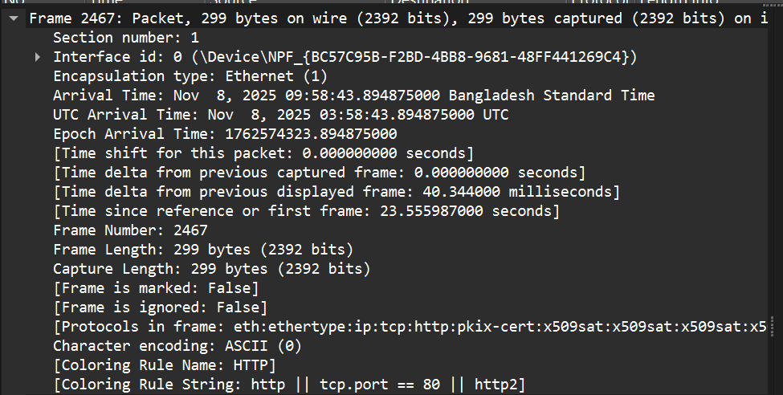 |

This is not a protocol header. It's metadata that Wireshark records for every captured frame: arrival timestamp, capture interface, frame length (308 B and 299 B) and the protocol stack it detected (`eth:ethertype:ip:tcp:http`). The response stack also includes `pkix-cert` and a run of `x509sat` entries, because Wireshark goes on to decode the certificate inside the HTTP body.

### 2. Data link: Ethernet II

| Request | Response |
|---|---|
| 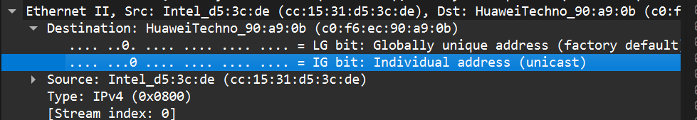 | 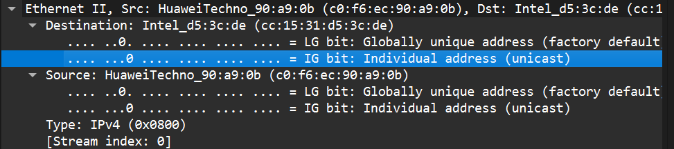 |

| | Source MAC | Destination MAC |
|---|---|---|
| Request | `cc:15:31:d5:3c:de` (Intel, the laptop's NIC) | `c0:f6:ec:90:a9:0b` (Huawei, the default gateway) |
| Response | `c0:f6:ec:90:a9:0b` | `cc:15:31:d5:3c:de` |

- The MAC addresses are **swapped** between request and response.
- The destination MAC is the **gateway router's**, not the web server's. MAC addresses only matter on the local link, and each router hop rewrites them.
- `EtherType 0x0800` tells the receiver that the payload is IPv4.
- The LG/IG bits show both are globally unique (factory-assigned) unicast addresses.

### 3. Network: IPv4

| Request | Response |
|---|---|
| 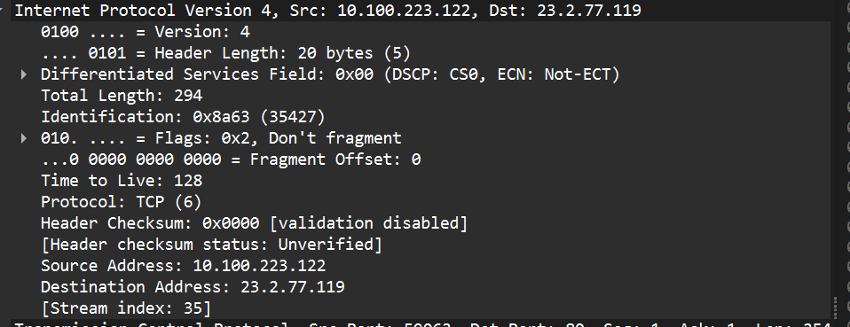 | 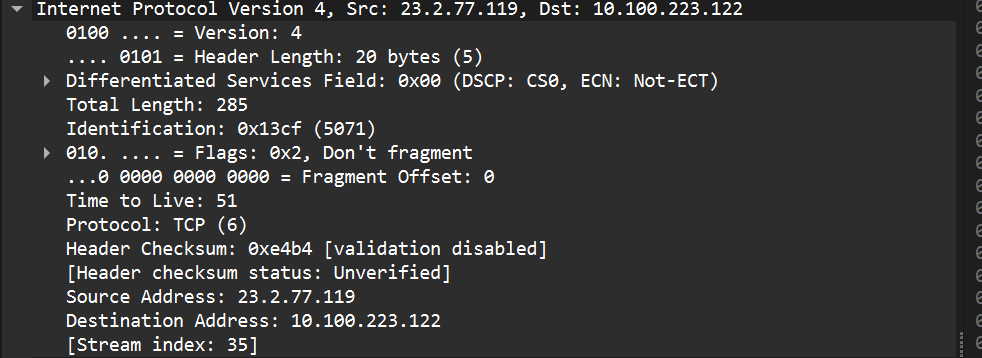 |

| Field | Request | Response |
|---|---|---|
| Source → Destination | 10.100.223.122 → 23.2.77.119 | 23.2.77.119 → 10.100.223.122 |
| Total length | 294 B | 285 B |
| TTL | 128 | 51 |
| Flags | Don't Fragment | Don't Fragment |
| Protocol | 6 (TCP) | 6 (TCP) |

- The IP addresses are **swapped**, like the MACs, but these stay the same end to end.
- `10.100.223.122` is a private (RFC 1918) address, so it gets NAT-translated before the packet reaches the internet.
- **TTL 128** is the Windows default, and the request was captured before leaving the laptop. The response's **TTL 51** fits a server that started at 64 and crossed about 13 routers.
- **Don't Fragment** is set on both. Modern stacks rely on Path MTU Discovery instead of fragmentation.
- The request's header checksum shows `0x0000` because checksum offloading means the NIC fills it in after Wireshark has captured the packet.
- Sizes add up: 14 B Ethernet + 294 B IP = 308 B frame. 20 B IP + 20 B TCP + 254 B payload = 294 B.

### 4. Transport: TCP

| Request | Response |
|---|---|
| 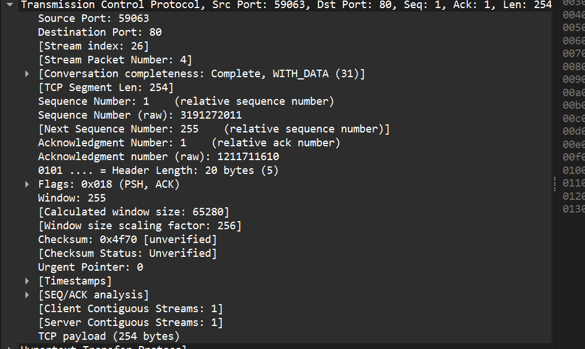 | 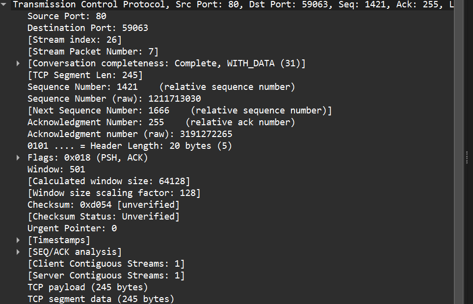 |

| Field | Request | Response |
|---|---|---|
| Ports | 59063 → **80** | **80** → 59063 |
| Sequence number (relative) | 1 | 1421 |
| Acknowledgement (relative) | 1 | 255 |
| Segment length | 254 B | 245 B |
| Flags | PSH, ACK | PSH, ACK |
| Window | 255 × 256 = 65 280 B | 501 × 128 = 64 128 B |

- The client picked an **ephemeral source port** (59063) and connected to the well-known HTTP port 80. The response swaps them.
- Seq 1 / Ack 1 means this is the first data after the three-way handshake. Wireshark shows relative numbers; the raw sequence number is 3191272011.
- The response's **Ack 255** is the request's next sequence number (1 + 254). It confirms the server received the whole request.
- The response segment starts at **Seq 1421**, so 1420 bytes of the response came in earlier segments. The HTTP response (about 1665 B) is too big for one segment. Wireshark reassembles it and attaches the HTTP dissection to the final segment, frame 2467.
- The window sizes use the **window scale** option negotiated during the handshake (×256 and ×128).

### 5. Application: HTTP

| Request | Response |
|---|---|
| 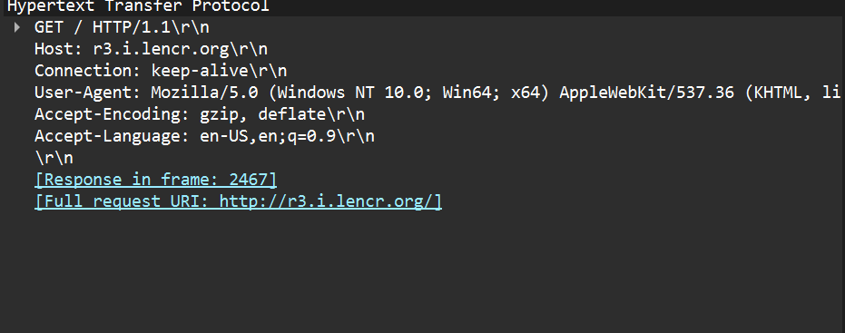 | 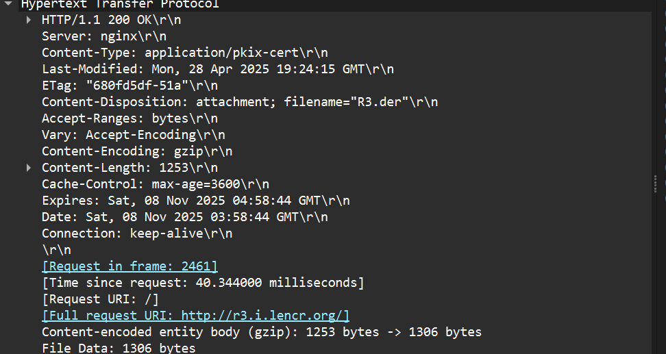 |

**Request.** The request line `GET / HTTP/1.1` is followed by headers:
- `Host`: required in HTTP/1.1 so one IP can serve many sites
- `Connection: keep-alive`: reuse the TCP connection
- `User-Agent`: identifies the browser
- `Accept-Encoding: gzip, deflate`: compression formats the browser accepts
- `Accept-Language`

The headers end with an empty `\r\n` line.

**Response.** The status line `HTTP/1.1 200 OK` is followed by headers:
- `Server: nginx`
- `Content-Type: application/pkix-cert`
- `Content-Disposition: attachment; filename="R3.der"`
- `Content-Encoding: gzip` and `Content-Length: 1253`
- Caching headers: `Cache-Control: max-age=3600`, `Expires`, `ETag`, `Last-Modified`
- `Connection: keep-alive`

There are no cookies in this exchange.

Gzip took the body from 1306 B to 1253 B, only about 4% smaller. A DER certificate is mostly signatures and keys, which barely compress.

---

## Other things in the capture

- **Frame 2704** is a `[TCP Retransmission]` of a CSS response from another server (146.190.62.39). A segment was lost or delayed and TCP resent it without the application noticing.
- The page load from 146.190.62.39 shows how one page turns into many requests: HTML first, then JavaScript, CSS, SVG images and a favicon.
- The last pair is Windows' connectivity check (`GET /connecttest.txt`), which Windows uses to decide whether the network has internet access.
